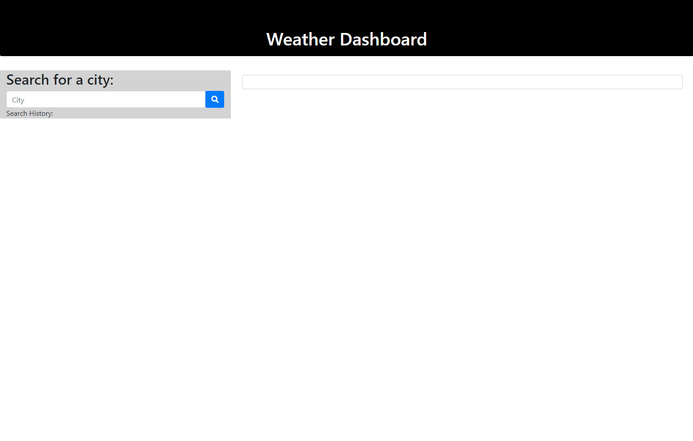
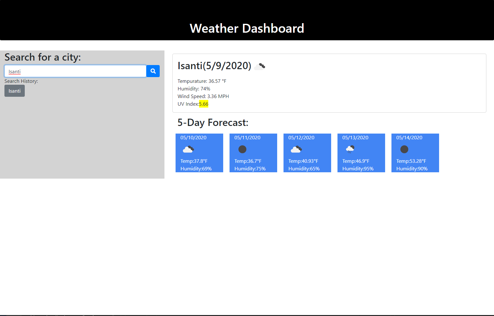

# WeatherDashboard
5 Day weather dashboard with search functionality and history
Purpose is to dynamically generate weather data based on a users inputted city

## Requirements
1. Must have form input for users city name
2. After user submits city name then page is dynamically generated and displays current weather(city name, date, weather condition icon, temperature, humidity, and uv index), 5 day forcast(date, weather condition icon, temperature, and humidity), and adds the city to a Search History section
3. Clicking on a city in the Search History should then re-display that cities data

## Link to project
https://iron318davis.github.io/WeatherDashboard/

## Images of Weather Dashboard  

